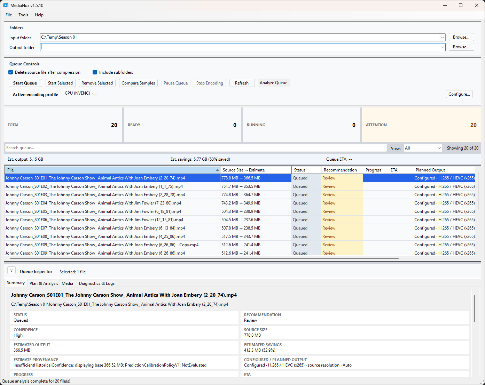
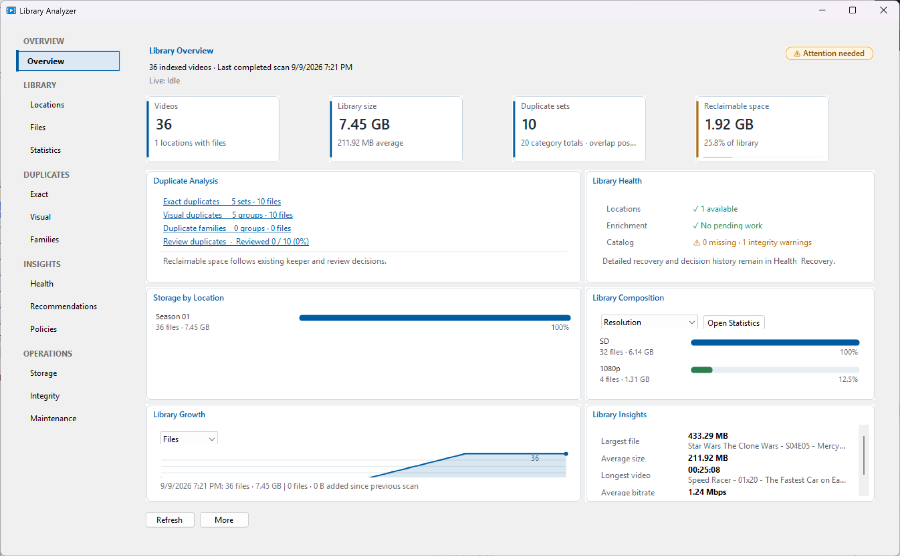
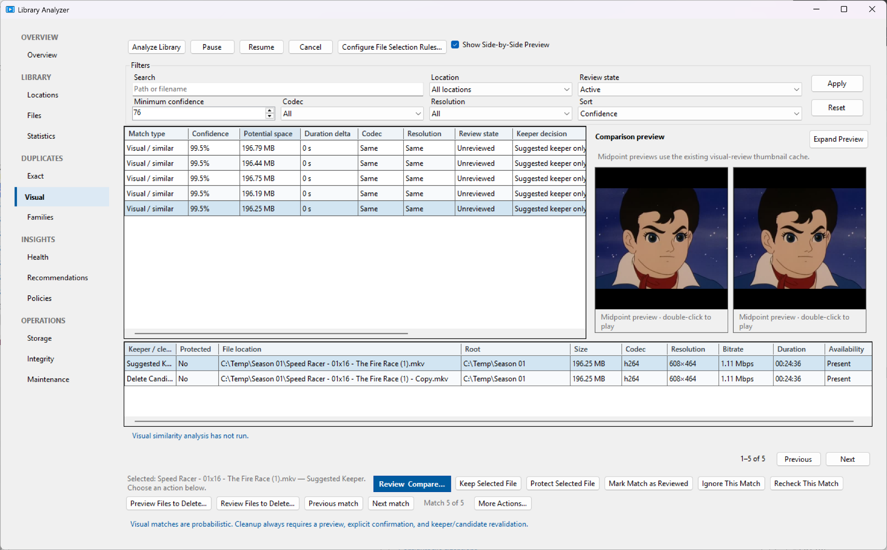
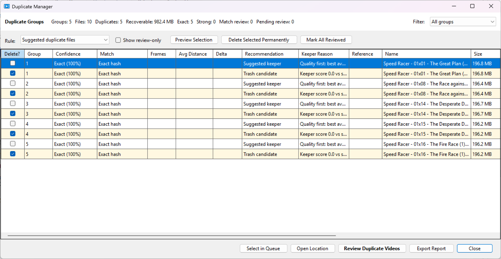
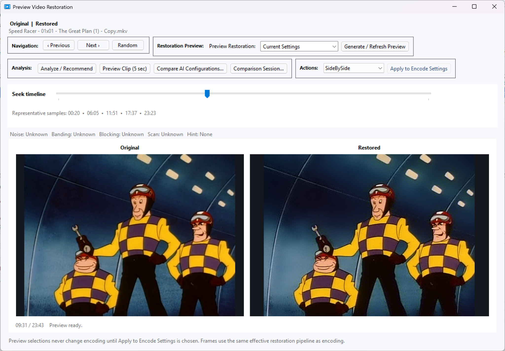
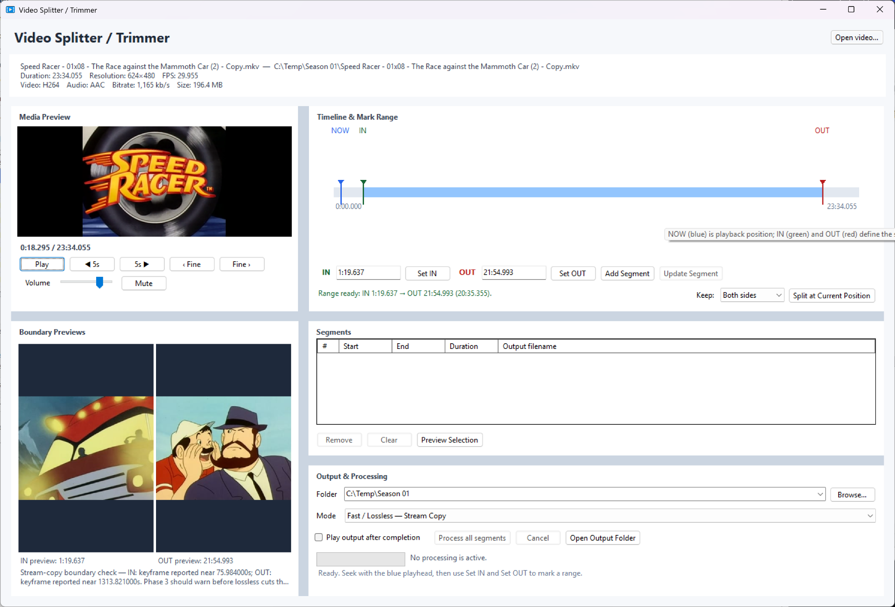

# 🎬 MediaFlux

MediaFlux is a Windows desktop application for shrinking, inspecting, restoring, organizing, and maintaining video libraries. Its queue-based workflows combine FFmpeg/FFprobe media processing with explainable estimates, previews, validation, history, and explicit review before destructive actions.

Use it to reduce storage without guessing, find exact or visually similar duplicates, restore difficult footage, split videos into verified segments, and understand what happened to every job.

<p align="center">
  
</p>

*The queue workspace brings operational status, search, execution priority, estimates, and the Queue Inspector together.*

## ✨ Highlights

- Batch encoding with an operational queue dashboard, search and operational views, customizable columns, a consolidated Queue Inspector, logical execution ordering, Encode Next and explicit priority management, plus estimates, progress, ETA, retry, pause/resume, scheduling, and queue import/export
- Encoding Plans that explain output characteristics, stream actions, target-size budgets, quality decisions, and validation/finalization outcomes
- CPU encoding plus NVIDIA NVENC and Intel Quick Sync (QSV), subject to the selected FFmpeg build and available hardware
- Library Analyzer with inventory, overview, statistics, health, insights, policies, integrity checks, storage opportunities, and maintenance
- Exact duplicates, visual duplicates, and duplicate families with confidence evidence, keeper decisions, protected files, review states, and guarded cleanup
- Video restoration with representative previews, Original vs Restored comparison, analysis/recommendations, optional AI configuration comparison, and explicit application to encoding
- Video Splitter / Trimmer with timeline navigation, IN/OUT points, segment lists, preview, stream-copy mode, and validated exports
- Job History, live diagnostics, technical details, logs, requeue, backups, updates, watch folders, Explorer integration, and optional Discord notifications

## 🧠 Encoding Intelligence

The modern queue workspace brings operational status and per-job detail into one place. Total, Ready, Running, and Attention summaries show the queue at a glance. Search matches filenames and paths; the operational View offers All, Ready, Running, Attention, Encode, Skip, and Review, with a `Showing X of Y` count. These presentation filters do not change which jobs are eligible or their execution order.

The consolidated **Queue Inspector** has **Summary**, **Plan & Analysis**, **Media**, and **Diagnostics & Logs** tabs. Queue columns can be shown or hidden, resized, and reordered; those preferences persist. The **Order** column shows logical execution position. Sorting or filtering the grid changes only presentation, not execution order.

**Start Queue** and **Start Selected** follow logical execution order. Use the **Queue Priority** commands deliberately to change it: **Encode Next**, **Move to Top**, **Move Up**, **Move Down**, and **Move to Bottom**. Ctrl/Shift multi-selection moves selected jobs as an order-preserving block. During an active run, already-running or dispatched jobs remain protected while undispatched pending jobs can be reprioritized safely.

Queue analysis can identify likely savings and explain why a file is a strong candidate, moderate candidate, skip, or review item. Recommendations are advisory; they do not silently change settings or remove files.

The Encoding Plan summarizes the intended operation before work begins, including:

- planned codec, encoder, container, resolution, and stream mapping
- video re-encode, audio/subtitle handling, passthrough, conversion, and compatibility decisions
- automatic or manual target-size budgets and projected output characteristics
- quality decisions, source assessment, and per-file adaptive estimates
- historical/advisory predictions when enough local history is available
- preflight checks, recovery choices for readable source timelines, and final validation state

**Compare Samples** generates representative beginning, middle, and end samples for synchronized original-versus-encoded review, with projected size, bitrate, speed, and ETA information. Preview and analysis actions are separate from starting the production encode.

## 🎯 Quality, Compression & Output

MediaFlux supports automatic source-adaptive quality estimates and manual control. The effective quality mechanism depends on the selected encoder: supported paths expose the terminology used by that provider, including **CRF**, **CQ**, or **ICQ** where applicable. A target-size budget can take precedence over constant-quality mode and is reflected in the plan and estimates.

Per-file settings can include codec, encoder, speed preset, quality, target size, resolution, bit depth, audio, subtitles, stream mapping, filename behavior, and MP4/MKV/Auto container selection. MediaFlux reports unavailable encoder capabilities instead of silently substituting another encoder.

## 📚 Library Analyzer

The Library Analyzer maintains an indexed catalog of selected folders and drives without requiring every file to be loaded into the encoding queue. Its dashboard and drill-down views cover:

- library size, composition, growth/history, locations, files, and statistics
- duplicate counts, reclaimable-space opportunities, and library health
- searchable and sortable inventory with media information and re-analysis
- library policies with explainable compliance and recommendations
- integrity checks, storage/maintenance operations, and per-location scheduled maintenance
- storage optimization that distinguishes exact reclaim, reviewed duplicate cleanup, and estimated re-encode savings

Scans preserve catalog evidence when a location is disconnected, incomplete, canceled, or inaccessible. Scheduled maintenance is opt-in and can refresh analysis and run targeted integrity work, but it cannot approve cleanup or start encodes by itself.

<p align="center">
  
</p>

*The Library Analyzer dashboard summarizes inventory, storage utilization, duplicate statistics, reclaimable space, locations, composition, and health.*

## 🔍 Duplicate Detection & Cleanup

MediaFlux provides both queue-oriented duplicate scans and catalog-backed Library Analyzer workflows.

- **Exact duplicates** use SHA-256 evidence to form groups and support keeper preferences, protected files, review/ignore decisions, reanalysis, comparison, and multi-selection.
- **Visual duplicates** use similarity evidence, confidence, media characteristics, embedded previews, playback, and side-by-side comparison. A visual match is a review aid, not proof that two files are interchangeable.
- **Duplicate families** group related visual evidence for family-level review and keeper selection.
- **Duplicate Manager** provides explicit cleanup previews, manual delete selection, survivor/keeper protection, and revalidation before execution.

<p align="center">
  
</p>

*Visual duplicate review keeps similarity evidence, confidence, comparison, and keeper decisions together before cleanup.*

Cleanup eligibility is checked against current file state, protection, stale or missing evidence, hard links, and keeper ambiguity. Depending on configuration, eligible files can be sent to the Recycle Bin, quarantined, or permanently deleted. No duplicate cleanup is implicit.

<p align="center">
  
</p>

*Duplicate Manager provides the explicit review and protected-keeper step before eligible files can be cleaned up.*

## 🪄 Video Restoration

Restoration is opt-in. It can combine conservative FFmpeg processing with settings for denoise, deblocking, debanding, sharpening, deinterlacing, color adjustments, and output resize. Built-in restoration profiles include vintage animation, DVD animation, and VHS/TV capture workflows.

The restoration preview surface supports representative source positions, **Original | Restored** still comparison, a synchronized motion preview, and **Analyze / Recommend**. Recommendations remain reviewable until explicitly applied to the encode settings. **Compare AI Configurations** can compare locally available AI models and configurations for the selected source window.

AI restoration requires a compatible locally configured provider and model. The current UI exposes **NCNN Vulkan** and **NVIDIA TensorRT** providers when ready; DirectML and CPU inference are reported as unavailable in this implementation. AI restoration is never enabled automatically.

<p align="center">
  
</p>

*Restoration preview supports representative samples, Original-versus-Restored comparison, analysis, and explicit configuration selection.*

## ✂️ Video Splitter / Trimmer

Open **Tools → Video Splitter / Trimmer** to load a video, navigate its timeline, set IN/OUT points, preview boundaries, and build named segments. Exports support stream copy where suitable or re-encoding through the selected encoder settings.

Each segment is written to staged output, checked with FFprobe, and promoted with collision-safe naming. Cancellation or failure does not alter the source video.

<p align="center">
  
</p>

*The splitter combines timeline navigation, boundary preview, segment creation, and validated stream-copy or re-encode export.*

## 📋 Job History & Diagnostics

**Job History** records completed, failed, and canceled video/audio operations. Search and filter by status, type, and date; inspect summaries, technical details, and logs; open source/output paths; copy diagnostic details; delete history entries; or requeue an available source.

The live Diagnostics view reports speed, FPS, bitrate, elapsed time, ETA, encoder/preset, concurrency, CPU and GPU observations when available, and maintenance overlap. Error Log and duplicate-action auditing provide additional investigation history. Values that cannot be measured are shown as unavailable rather than inferred.

## 🤖 AI Benchmark Manager

AI Benchmark Manager stores benchmark results for locally available AI configurations. It supports filtering, detailed inspection, rerunning selected configurations, comparing selected results with charts, importing/exporting records, and removing selected or obsolete records. Benchmark reruns create temporary validated output and are separate from production encoding.

## 🎵 Audio, DVD & Other Workflows

- **Audio tools:** batch extraction/conversion with format and quality choices, optional loudness normalization, optional RNNoise denoising, progress, and history.
- **DVD import:** title/folder analysis, title selection, output choices, remux/encode workflows, and validation for supported DVD sources.
- **Commercial Detector:** analysis of candidate commercial boundaries with boundary previews, review, saved analysis, and selected-segment export.
- **Automation:** watch folders, optional Windows Explorer commands, scheduled work, completion webhooks, backups, and in-app updates.

## ⚙️ Configuration, Profiles & Data

Settings persist application behavior, supported extensions, encoder/output choices, cleanup capabilities, restoration settings, watch folders, notifications, and maintenance preferences. Encode presets save reusable combinations of encoder, quality, audio, container, restoration, and related settings. Applying a preset changes the working configuration; it does not modify media or start an encode.

User data is stored under `%LocalAppData%\\MediaFlux\\UserData`, including configuration, presets, history, logs, caches, and the Library Analyzer catalog. Application updates replace application files without replacing user data. Manual backup/restore and optional pre-update user-data backups are available from Settings.

## 🛡️ Safety & Data Protection

MediaFlux is deliberately conservative around source media:

- Encodes and splitter exports use staged files and validation before promotion.
- Validation checks media structure, streams, duration, container compatibility, and representative decode regions; promoted outputs are checked again.
- Failed, canceled, incomplete, or changed outputs do not replace the source. Requested source deletion occurs only after successful validation and finalization checks.
- Restoration previews do not affect encoding until **Apply to Encode Settings** is chosen.
- Duplicate cleanup requires explicit review/confirmation and protects keepers, protected files, stale evidence, and the final survivor.

These safeguards reduce accidental loss, but users should still keep independent backups of irreplaceable media.

## 💻 Requirements

### Required for normal media processing

- Windows 10 or Windows 11, x64
- `ffmpeg.exe` and `ffprobe.exe`
- An FFmpeg build containing the encoder selected in MediaFlux, such as `libx264`, `libx265`, or SVT-AV1 for CPU encoding

MediaFlux resolves FFmpeg and FFprobe from configured Settings paths, beside the application, or a `programs`/`Programs` directory beside the application. A compatible GPU is not required for CPU operation.

### Optional capabilities

- NVIDIA GPU and current drivers for NVENC and NVIDIA TensorRT
- Compatible Intel hardware/drivers and FFmpeg support for QSV
- A configured local AI provider and compatible model for AI restoration
- An RNNoise model file when audio denoising is enabled

The GitHub release workflow publishes a self-contained Windows x64 build, so the .NET runtime is not required for normal installed use.

## 🚀 Installation & Quick Start

Download the latest installer from [GitHub Releases](https://github.com/SuperBee516/MediaFlux/releases). Configure FFmpeg/FFprobe in **Settings** if MediaFlux does not find them automatically.

Typical encoding workflow:

1. Add files or a folder to the Encode Queue; use search and the operational View to find the jobs you want.
2. Review the queue summaries, estimates, recommendations, and **Plan & Analysis** in the Queue Inspector.
3. Adjust quality, target size, streams, container, preset, or optional restoration settings.
4. Use **Compare Samples** or restoration preview when visual review is useful.
5. Use **Start Selected** or **Start Queue** and monitor progress and ETA. Use **Queue Priority** if you want to change logical execution order; grid sorting and filtering do not change it.
6. Review the result in Job History and inspect diagnostics if needed.

Installed copies can use **Help → Check for Updates** to check the stable release channel, review release notes, download, and restart. Building from source requires the [.NET 8 SDK](https://dotnet.microsoft.com/download/dotnet/8.0):

```powershell
dotnet restore .\MediaFlux.sln
dotnet build .\MediaFlux.sln
dotnet run --project .\MediaFlux.csproj
```

## 🔧 Technology & Further Documentation

MediaFlux is a .NET 8 Windows Forms application using FFmpeg/FFprobe, SQLite, and provider-based encoder integrations. The repository includes focused automated tests for encoding, restoration, duplicate management, Library Analyzer workflows, diagnostics, and persistence.

- [User Guide](Documentation/UserGuide.md)
- [Library Catalog notes](docs/library-catalog.md)
- [Architecture notes](docs/architecture.md)
- [Development notes](docs/development.md)
- [Changelog](CHANGELOG.md)

## 📄 License

MediaFlux is licensed under the [MIT License](LICENSE).
